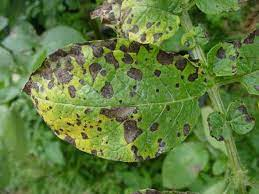
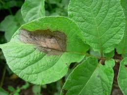

# Early-Late-Blight-Potato-Recognition

## Introduction

This project aims at building a diseases identification system to recognize early blight and late blight on potato leaf automatically.

Potato is one of the popular foods of Vietnamese people and some countries in the world. As with other food crops, diseases can seriously affect the yield and quality of the harvest. Therefore, in addition to disease prevention, early detection of diseases on plants can somewhat reduce the impact of diseases and farmers can offer timely solutions. 



In this projects, I built disease identification software system based on potato leaf images using deep learning network and a mobile robot system. There are 2 deep learning models were used: **VGG16** (classify the diseases) and **UNet** (remove background).

## Prepare data

**1. For classification**

The dataset for this project was collect from [Kaggle](https://www.kaggle.com/datasets/vipoooool/new-plant-diseases-dataset). The data included 2391 late blight disease photos, 2391 early blight photos, and 2262 healthy photos leaf (7044 total). 

**2. For segmentation**

The copy of the above dataset was annotated and add background for segmentation phase. I use [Labelme](https://github.com/wkentaro/labelme) in this project.

To prepare the data, I recommend to create data/Train and data/Test folders in a location separate from your code folder. Then create the following structure as in the image below:

## Training

These both models was trained on Google Colab with a virtual computer that has the following configuration Tesla T4 GPU 15 GB, 12 GB RAM, Intel (R) Xeon (R) CPU 2.20GHz.

**1. Segmentation**


## UI design

Besides, the user interface was created for easy to deploy these both models and control the robot from the long distance. Here, the project uses the PyQt5 open source library combined with the software Qt5 Designer. The PyQt5 library supports the Python language, which pairs well with the model predict the disease of potato leaves, because of the ease of access and use that PyQt5 and Qt5 Designer is selected. 

The software is designed to include 3 main tasks: displaying leaf images were photographed and showed leaf disease status, time and disease of the leaves captured during robot operation and control movement of the remote robot.

## Communication

The robot communicate with the server by using [Firebase](https://firebase.google.com/).

## Installation 

Download pretrained models: [VGG16](), [Unet](). Then, change the **CLASSIFY_MODEL_NAME** and **SEGMENT_MODEL_NAME** in utils/config.py.

```
- Clone this repository
- pip install -r requirements.txt
- python main.py
```

